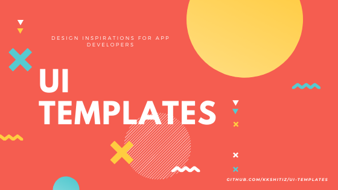

<!-- ALL-CONTRIBUTORS-BADGE:START - Do not remove or modify this section -->

<!-- ALL-CONTRIBUTORS-BADGE:END -->

Design inspirations for app developers

    <a href="">
     

## Categories
Click on Category name to directly skip to that Category 

<table class="nice-table">
    <tbody>
      <tr>
        <th>Category</th>
        <th>Examples</th>
      </tr>
      <tr>
        <td><a href="#art-and-design">Art &amp; Design</a></td>
        <td>Sketchbooks, painter tools, art &amp; design tools, coloring books</td>
      </tr>
      <tr>
        <td><a href="#auto-and-vehicles">Auto &amp; Vehicles</a></td>
        <td>Auto shopping, auto insurance, auto price comparison, road safety, auto reviews &amp; news</td>
      </tr>
      <tr>
        <td><a href="#beauty">Beauty</a></td>
        <td>Makeup tutorials, makeover tools, hair styling, beauty shopping, makeup simulators</td>
      </tr>
      <tr>
        <td><a href="#books-and-reference">Books &amp; Reference</a></td>
        <td>Book readers, reference books, text books, dictionaries, thesaurus, wikis</td>
      </tr>
      <tr>
        <td><a href="#business">Business</a></td>
        <td>Document editor/reader, package tracking, remote desktop, email management, job search</td>
      </tr>
      <tr>
        <td><a href="#comics">Comics</a></td>
        <td>Comic players, comic titles</td>
      </tr>
      <tr>
        <td><a href="#communications">Communications</a></td>
        <td>Messaging, chat/IM, dialers, address books, browsers, call management</td>
      </tr>
      <tr>
        <td><a href="#dating">Dating</a></td>
        <td>Matchmaking, courtship, relationship building, meeting new people, finding love</td>
      </tr>
      <tr>
        <td><a href="#education">Education</a></td>
        <td>Exam preparations, study-aids, vocabulary, educational games, language learning</td>
      </tr>
      <tr>
        <td><a href="#entertainment">Entertainment</a></td>
        <td>Streaming video, Movies, TV, interactive entertainment</td>
      </tr>
      <tr>
        <td><a href="#events">Events</a></td>
        <td>Concert tickets, sporting event tickets, ticket resales, movie tickets</td>
      </tr>
      <tr>
        <td><a href="#finance">Finance</a></td>
        <td>Banking, payment, ATM finders, financial news, insurance, taxes, portfolio/trading, tip calculators</td>
      </tr>
      <tr>
        <td><a href="#food-and-drink">Food &amp; Drink</a></td>
        <td>Recipes, restaurants, food guides, wine tasting &amp; discovery, beverage recipes</td>
      </tr>
      <tr>
        <td><a href="#health-and-fitness">Health &amp; Fitness</a></td>
        <td>Personal fitness, workout tracking, diet and nutritional tips, health &amp; safety, etc.</td>
      </tr>
      <tr>
        <td><a href="#house-and-home">House &amp; Home</a></td>
        <td>House &amp; apartment search, home improvement, interior decoration, mortgages, real estate</td>
      </tr>
      <tr>
        <td><a href="#libraries-and-demo">Libraries &amp; Demo</a></td>
        <td>Software libraries, technical demos</td>
      </tr>
      <tr>
        <td><a href="#lifestyle">Lifestyle</a></td>
        <td>Style guides, wedding &amp; party planning, how-to guides</td>
      </tr>
      <tr>
        <td><a href="#maps-and-navigation">Maps &amp; Navigation</a></td>
        <td>Navigation tools, GPS, mapping, transit tools, public transportation</td>
      </tr>
      <tr>
        <td><a href="#medical">Medical</a></td>
        <td>Drug &amp; clinical references, calculators, handbooks for health-care providers, medical journals &amp; news</td>
      </tr>
      <tr>
        <td><a href="#music-and-audio">Music &amp; Audio</a></td>
        <td>Music services, radios, music players</td>
      </tr>
      <tr>
        <td><a href="#news-and-magazines">News &amp; Magazines</a></td>
        <td>Newspapers, news aggregators, magazines, blogging</td>
      </tr>
      <tr>
        <td><a href="#parenting">Parenting</a></td>
        <td>Pregnancy, infant care &amp; monitoring, childcare</td>
      </tr>
      <tr>
        <td><a href="#personalization">Personalization</a></td>
        <td>Wallpapers, live wallpapers, home screen, lock screen, ringtones</td>
      </tr>
      <tr>
        <td><a href="#photography">Photography</a></td>
        <td>Cameras, photo editing tools, photo management and sharing</td>
      </tr>
      <tr>
        <td><a href="#productivity">Productivity</a></td>
        <td>Notepad, to do list, keyboard, printing, calendar, backup, calculator, conversion</td>
      </tr>
      <tr>
        <td><a href="#shopping">Shopping</a></td>
        <td>Online shopping, auctions, coupons, price comparison, grocery lists, product reviews</td>
      </tr>
      <tr>
        <td><a href="#social">Social</a></td>
        <td>Social networking, check-in</td>
      </tr>
      <tr>
        <td><a href="#sports">Sports</a></td>
        <td>Sports news &amp; commentary, score tracking, fantasy team management, game coverage</td>
      </tr>
      <tr>
        <td><a href="#tools">Tools</a></td>
        <td>Tools for Android devices</td>
      </tr>
      <tr>
        <td><a href="#travel-and-local">Travel &amp; Local</a></td>
        <td>Trip booking tools, ride sharing, taxis, city guides, local business information, trip management tools, tour booking</td>
      </tr>
      <tr>
        <td><a href="#video-players-and-editors">Video Players &amp; Editors</a></td>
        <td>Video players, video editors, media storage</td>
      </tr>
      <tr>
        <td><a href="#weather">Weather</a></td>
        <td>Weather reports</td>
      </tr>
    </tbody>
  </table>

  **Source:** [Google Play Console help](https://support.google.com/googleplay/android-developer/answer/113475?hl=en)

  

  
  ## UX/UI Resources
  The links for awesome UX/Ui resources at one place
   
  
  | INSPIRATION | CREATIVE | TOOLS | PATTERNS | ILLUSTATIONS | ICONS |
  | :---------: | :------: | :---: | :------: | :----------: | :---: |
  | [Mobbin](https://mobbin.design/) | [Behance](https://www.behance.net/) | [Frame Box](http://framebox.org/) | [UI Patterns](https://ui-patterns.com/) | [UnDraw](https://undraw.co/) | [Streamline 3.0](https://streamlineicons.com/) |
  | [Mobile Patterns](https://www.mobile-patterns.com/) | [Dribble](https://dribbble.com/) | [Wireframe](https://wireframe.cc/) | [Design Snips](http://designsnips.com/) | [DrawKit](https://www.drawkit.io/) | [Font Awesome](https://fontawesome.com/) |
  | [Pttrns](https://pttrns.com/) | [Site Inspire](https://www.siteinspire.com/) | [Creately](https://creately.com/) | [UI Garage](https://uigarage.net/) | [Absurd Illustrations](https://absurd.design/) | [Freepik](https://www.freepik.com/) |
  | [UI Movement](https://uimovement.com/) | [Creative Bloq](https://www.creativebloq.com/) | [Free Mind](http://freemind.sourceforge.net/wiki/index.php/Main_Page) | [Product Design Tips](https://productdesign.tips/) | [Many Pixels](https://www.manypixels.co/) | [FlatIcon](https://www.flaticon.com/) |
  | [Collect Ui](https://collectui.com/) | [Lapa Ninja](https://www.lapa.ninja/) | [Fontself](https://www.fontself.com/) | [Facebook Design](https://facebook.design/) | [Humaaans](https://www.humaaans.com/) | [Iconmonstr](https://iconmonstr.com/) |
  | [UpLabs](https://www.uplabs.com/) | [Beautiful Pixels](https://beautifulpixels.com/) | [Invision Studio](https://www.invisionapp.com/studio) | [UIE](https://www.uie.com/) | [IRA Design](https://iradesign.io/) | [Fontello](http://fontello.com/) |
  | [Learn UI](https://learnui.design/) | [Design Shack](https://designshack.net/) | [CleanMock](https://cleanmock.com/) | [UI Sources](https://www.uisources.com/) | [Interfacer](https://interfacer.xyz/) | [Icons8](https://icons8.com/) |
  | [Neede](https://neede.co/#/) | [Awwwards](https://www.awwwards.com/) | [Photopea](https://www.photopea.com/) | [Paaatterns](https://products.ls.graphics/paaatterns/) | [Freebie Supply](https://freebiesupply.com/) | [Iconshock](https://www.iconshock.com/) |
  
   
  
  | COLOR | UI GRADIENTS | FONT TOOLS | STOCK IMAGES | UX RESEARCH | OTHERS |
  | :---: | :-------: | :----------: | :--------: | :----------: | :---------: |
  | [Coolors](https://coolors.co/) | [Grabient](https://www.grabient.com/) | [FontArk](https://fontark.net/farkwp/) | [Pixabay](https://pixabay.com/) | [Keep It Usable](https://www.keepitusable.com/) | [Design Principles](http://learndesignprinciples.com/) |
  | [Picular](https://picular.co/) | [UI Gradients](https://uigradients.com/) | [Calligraphr](https://www.calligraphr.com/en/) | [Stocksnap](https://stocksnap.io/) | [UX Myths](https://uxmyths.com/) | [Learn Colors](https://www.canva.com/colors/) |
  | [Muzli Colors](https://colors.muz.li/) | [CoolHue](https://webkul.github.io/coolhue/) | [BirdFont](https://birdfont.org/) | [Burst](https://burst.shopify.com/) | [UX Movement](https://uxmovement.com/) | [Typography Handbook](https://typographyhandbook.com/) |
  | [Colorable](https://colorable.jxnblk.com/) | [Granim.js](https://sarcadass.github.io/granim.js/) | [FontForge](https://fontforge.org/en-US/) | [Pexels](https://www.pexels.com/) | [UX Matters](https://www.uxmatters.com/) | [Material Design](https://material.io/design) | 
  | [Flat Ui Colors](https://flatuicolors.com/) | [CSS Gradient](https://cssgradient.io/) | [FontStruct](https://fontstruct.com/) | [Splashbase](http://www.splashbase.co/) | [UX Stack Exchange](https://ux.stackexchange.com/) | [HI Guidelines](https://developer.apple.com/design/human-interface-guidelines/) | 
  | [Color Leap](https://colorleap.app/home) | [Web Gradients](https://webgradients.com/) | [Glyphr Studio](http://www.glyphrstudio.com/) | [Unsplash](https://unsplash.com/) | [Laws of UX](https://lawsofux.com/) | [HeyDesigner](https://heydesigner.com/) |
  
  ## Art and design
  
  

  
  

  

  ## Auto and Vehicles
  
  

  
  
  

  
  

  
  
  

  

  ## Beauty
  
  

  
  
  

  
  

  
  

  

  ## Books and Reference
  
  

  
  
  

  
  

  
  
  

  
  

  ## Business
  
  

  
  
  

  
  

  
  

  

  ## Comics
  
  

  
  
  

  
  

  
  
  

  
  

  
  

  

  ## Communications
  
  

  
  

  

  ## Dating
  
  

  
  

  

  ## Education
  
  

  
  
  

  
  

  
  
  

  
  

  
  

  
  

  ## Entertainment
  
  

  
  
  

  
  

  
  

  
  

  ## Events
  
  

  
  

  

  ## Finance
  
  

  
  
  

  
  

  
  
  

  
  

  
  
  

  
  

  
  
  

  
  

  ## Food and Drink
  
  

  
  
  

  
  

  
  
  

  
  

  
  

  
  

  ## Health and Fitness
  
  

  
  
  

  

  ## House and Home
  
  

  
  
  

  
  

  
  
  

  

  ## Libraries and Demo
  
  

  
  

  

  ## Lifestyle
  
  

  
  

  
  

  ## Maps and Navigation
  
  

  
  

  
  

  ## Medical
    
  

  
  
  

  
  

  
  

  
  

  ## Music and Audio
  
  

  
  
  

  
  

  
  
  

  
  

  
  

  

  ## News and Magazines

  

  ## Parenting

  

  ## Personalization

  

  ## Photography

  

  ## Productivity
  
  

  
  

  

  ## Shopping
  
  

  
  
  

  
  

  
  
  

  
  

  
  
  

  
  

  
  
  

  
  

  
  
  

  

  ## Social
  
  

  
  
  

  

  ## Sports

  

  ## Tools
  
  

  
  
  

  
  

  
  

  

  ## Travel and Local
  
  

  
  
  

  

  ## Video Players and Editors
  
  

  
  
  

  
  

  
  

  

  ## Weather
  
  

  
  
  

  
  

  
  
  

  

## Contributors

<!-- ALL-CONTRIBUTORS-LIST:START - Do not remove or modify this section -->
<!-- prettier-ignore-start -->
<!-- markdownlint-disable -->
<table>
  <tr>
    <td align="center"><a href="http://academicstud.wordpress.com"> <b>Kshitiz Kamal</b></a> <a href="#ideas-KKshitiz" title="Ideas, Planning, & Feedback">🤔</a></td>
  </tr>
</table>

<!-- markdownlint-enable -->
<!-- prettier-ignore-end -->
<!-- ALL-CONTRIBUTORS-LIST:END -->
## Contributing
In lieu of a formal styleguide, take care to maintain the existing style of this list. For details on how to contribute, see [Contributing](link to contribute.md)

## Sources
* [Dribbble](https://dribbble.com/)
* [Behance](https://www.behance.net/)

## Disclaimer
All the above works belong to their respective creators and owners. I don't take ownership of any of these designs nor aim to make monetary benefit from it.

